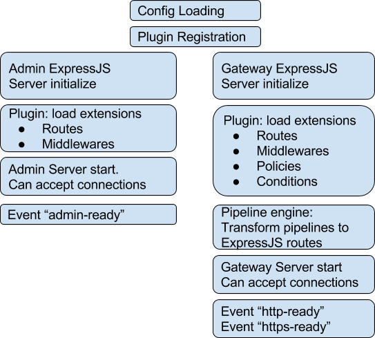

## Express Gateway boot sequence

Here is high level overview of what is happening inside Express Gateway and what are possible extension points

## Initial phase
#### Config Loading
Express Gateway loads config files (gateway.config.yml, system.config.yml etc). 
#### Plugin registration 
Based on “plugins” section in `system.config.yml` EG builds a list of plugins to load.

For each of the plugins it loads the plugin using Node.JS `require` function. 

Technically it would be like `require('plugin-name')(pluginContext)`.
As the result Express Gateway will know about all extensions (policies, conditions etc.) plugin provides

Details about `PluginContext` see in the [Development Guide]({{ site.baseurl}} )

*Note:* At this stage no policies or conditions or middlewares are executed. As well as there is no http servers that can accept connections. Express Gateway is just collecting information about extensions.

## Gateway initialization 
#### Gateway ExpressJS server initialize
Creates ExpressJS instance that will handle all requests to Express Gateway
#### Loading extensions for Gateway
Conditions, Policies, Routes and Middlewares registered in the system are now been initialized and can be used during request processing. 

For example:
- Routes and Middlewares are mounted onto ExpressJS Gateway application.
- Conditions and Policies are registered in the pipeline engine

#### Pipeline engine initialization
All defined pipelines are now transformed into ExpressJS routes and registered in ExpressJS Gateway application. 
#### Gateway Server start
Finally ExpressJS applications is starting and is exposed by 2 node.js servers: HTTP and HTTPS. Express Gateway start listening on configured ports. 
#### Events  
- `http-ready` - emitted once HTTP server starts listening on port 
- `https-ready` - emitted once HTTPS server starts listening on port 

## Admin API initialization 
#### Admin ExpressJS server initialize
Creates ExpressJS application that will handle all requests to Express Gateway Admin API. 
#### Loading extensions for Admin API
Admin Routes and middlewares registered in the system are now initialized and can be used during request processing. 
#### Admin Server start
Admin ExpressJS application is now exposed by node.js servers and start listening on configured port. Admin API is now ready to process requests
#### Events  
- `admin-ready` - emitted once Admin API server starts listening on the port 
